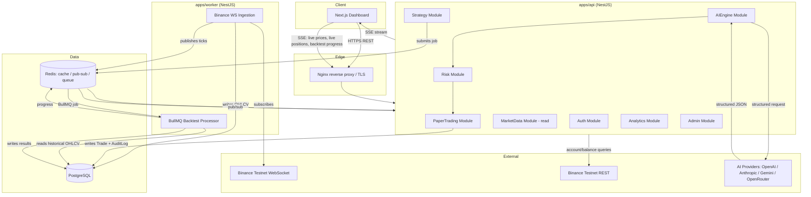
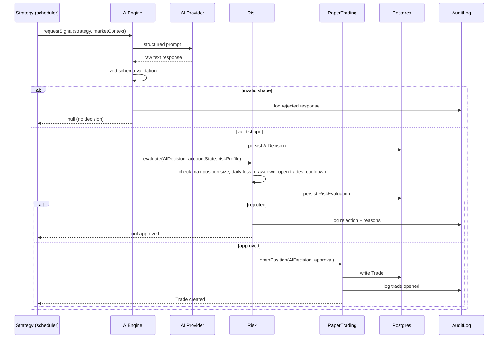

# AI Quant Research Platform — Architecture Spec (v2)

> Source-of-truth document for this build. Written for a Claude Code implementation
> session to work against, phase by phase. Do not skip ahead of the current phase.
> This is a paper-trading / research platform. It never executes real trades, and
> AI output is never trusted directly — every signal passes through schema
> validation and the risk engine before it can become a paper position.

**Status:** intended for public deployment (see §12, §13 for what that changes).

---

## Table of Contents

1. Goals & Non-Goals
2. Tech Stack & Rationale
3. System Architecture Diagram
4. Monorepo Structure
5. Module Boundaries
6. Database Schema
7. API Contracts
8. The AI → Risk → Trade Pipeline (+ sequence diagram)
9. Realtime Contracts (WebSocket/SSE)
10. API Error Contract
11. Security
12. Observability
13. Testing Strategy
14. Phase Roadmap
15. Architecture Decision Records
16. Notes for Claude Code Sessions

---

## 1. Goals & Non-Goals

**Goal:** demonstrate senior-level full-stack system design — clean architecture,
real-time data engineering, AI integration done safely, and testable, maintainable
code — as a public-facing portfolio flagship project.

**Non-goal:** profitability. No real trades, no real funds. Binance Testnet only,
everywhere, always — including in production.

**Constraint:** started zero-budget; now intended for public hosting, so cheap
(not necessarily free) hosting is in scope going forward. See §12 for what
public exposure changes.

---

## 2. Tech Stack & Rationale

| Layer | Choice | Why |
|---|---|---|
| Backend | Node.js + NestJS + TypeScript | Non-blocking I/O fits real-time market data; DI/modules give a genuine Clean Architecture story |
| Frontend | Next.js 15 + React + TypeScript | Matches backend language, largest hiring-pool relevance, SSR for dashboard |
| DB | PostgreSQL + Prisma | Relational integrity for trades/positions/audit trail; Prisma gives type-safe queries shared via generated types |
| Cache/Queue/PubSub | Redis + BullMQ | One dependency, three jobs: cache, live-price pub/sub fan-out to SSE clients, and the backtest job queue |
| Realtime | Binance WS → worker → Redis pub/sub → SSE to browser | Browser never talks to Binance directly; worker is the single ingestion point |
| Exchange | Binance Testnet, read-only + testnet-trade-only keys | No real funds ever reachable, even if a key leaks |
| AI | Provider-agnostic interface; OpenAI/Anthropic/Gemini/OpenRouter | Structured JSON only, zod-validated, never auto-executes |
| Auth | JWT + refresh tokens + RBAC | Standard, testable, demonstrates security awareness |
| Infra | Docker Compose, GitHub Actions, Nginx | Runs identically local and hosted; single source of deployment truth |

---

## 3. System Architecture Diagram



---

## 4. Monorepo Structure

```
quant-platform/
├── apps/
│   ├── web/                 # Next.js dashboard
│   ├── api/                 # NestJS HTTP API (auth, CRUD, queries)
│   └── worker/               # NestJS worker: Binance WS ingestion, BullMQ processors
├── packages/
│   ├── shared/                # DTOs, zod schemas, types — imported by web + api + worker
│   ├── exchange/               # Binance client wrapper (REST + WS), testnet-only guard
│   ├── ai-engine/               # Provider-agnostic AI interface + adapters
│   ├── indicators/               # Technical indicator functions (pure, unit-testable)
│   ├── backtester/                 # Backtest simulation engine
│   ├── risk/                        # Risk rule evaluation (pure functions over position state)
│   └── ui/                           # Shared shadcn/ui-based component library
├── docker-compose.yml          # base services: postgres, redis
├── docker-compose.dev.yml       # dev overrides: hot reload, exposed ports, seed data
├── docker-compose.prod.yml       # prod overrides: nginx, resource limits, no exposed db port
├── .env.example
├── .github/workflows/ci.yml
└── ARCHITECTURE.md
```

**Rule:** `packages/*` must have zero dependency on `apps/*`. Direction of
dependency is always apps → packages, never sideways between apps, never
packages → apps. This is what keeps `risk`, `indicators`, and `backtester`
independently unit-testable and reusable from both `api` and `worker`.

---

## 5. Module Boundaries

Each module below is a NestJS module in `apps/api` unless noted as living in
`worker`. Each has a single clear responsibility — this list is also your
Phase-by-phase build order (see §14).

1. **Auth** — JWT issue/refresh, RBAC guards/decorators. No business logic.
2. **Users** — profile, preferences, API-key storage (encrypted at rest).
3. **Exchange** (uses `packages/exchange`) — Binance Testnet key validation,
   symbol metadata, account balance queries (testnet balances only).
4. **MarketData** — OHLCV, funding rate, open interest storage + query API.
   Ingestion itself lives in `worker`; this module is read/query side in `api`.
5. **AIEngine** (uses `packages/ai-engine`) — request signal, validate response,
   persist `AIDecision` record with full reasoning + confidence for audit.
6. **Risk** (uses `packages/risk`) — evaluates a proposed trade against active
   rules (max position size, max daily loss, max drawdown, max open trades,
   cooldown-after-loss). Pure decision function: `evaluate(proposedTrade, accountState) -> { approved, reasons[] }`.
7. **PaperTrading** — owns the simulated ledger: positions, fills, PnL. The
   *only* module allowed to write a `Trade` row. Every write must have passed
   through Risk first — enforced at the service layer, not just convention.
8. **Backtesting** (uses `packages/backtester`) — job submission (BullMQ),
   progress tracking, results storage (equity curve, metrics).
9. **Strategy** — user-defined strategy configs (which AI provider, which
   symbols, which risk profile, backtest vs. live-paper toggle).
10. **Analytics** — aggregates PnL/win-rate/Sharpe/etc. across trades/strategies
    for dashboard consumption. Read-only, no writes.
11. **Notifications** — in-app + (optional) webhook on trade events, risk
    breaches, AI signal generated.
12. **Admin** — user management, system health view, feature flags.
13. **Audit** — immutable log of AI decisions, risk evaluations, and trade
    executions. Every write in modules 5–7 also writes here.

---

## 6. Database Schema (Prisma, v1)

```prisma
// packages/shared/prisma/schema.prisma

model User {
  id            String   @id @default(uuid())
  email         String   @unique
  passwordHash  String
  role          Role     @default(USER)
  createdAt     DateTime @default(now())
  refreshTokens RefreshToken[]
  exchangeKeys  ExchangeKey[]
  strategies    Strategy[]
  trades        Trade[]
}

enum Role {
  USER
  ADMIN
}

model RefreshToken {
  id        String   @id @default(uuid())
  userId    String
  user      User     @relation(fields: [userId], references: [id])
  tokenHash String
  expiresAt DateTime
  revoked   Boolean  @default(false)
}

model ExchangeKey {
  id            String   @id @default(uuid())
  userId        String
  user          User     @relation(fields: [userId], references: [id])
  label         String
  apiKeyEnc     String   // AES-256-GCM ciphertext, see §11
  apiSecretEnc  String
  isTestnet     Boolean  @default(true)
  createdAt     DateTime @default(now())
}

model Symbol {
  id       String @id @default(uuid())
  ticker   String @unique // e.g. BTCUSDT
  base     String
  quote    String
  isActive Boolean @default(true)
}

model OHLCV {
  id        String   @id @default(uuid())
  symbolId  String
  symbol    Symbol   @relation(fields: [symbolId], references: [id])
  interval  String   // 1m, 5m, 1h, 1d
  openTime  DateTime
  open      Decimal
  high      Decimal
  low       Decimal
  close     Decimal
  volume    Decimal

  @@unique([symbolId, interval, openTime])
  @@index([symbolId, interval, openTime])
}

model Strategy {
  id           String   @id @default(uuid())
  userId       String
  user         User     @relation(fields: [userId], references: [id])
  name         String
  aiProvider   String   // "openai" | "anthropic" | "gemini" | "openrouter:kimi"
  symbolIds    String[]
  riskProfileId String
  riskProfile  RiskProfile @relation(fields: [riskProfileId], references: [id])
  isActive     Boolean  @default(false)
  createdAt    DateTime @default(now())
  aiDecisions  AIDecision[]
  trades       Trade[]
  backtests    Backtest[]
}

model RiskProfile {
  id                String  @id @default(uuid())
  name              String
  maxPositionSizeUsd Decimal
  maxDailyLossUsd    Decimal
  maxDrawdownPct     Decimal
  maxOpenTrades      Int
  cooldownMinutesAfterLoss Int
  strategies        Strategy[]
}

model AIDecision {
  id          String   @id @default(uuid())
  strategyId  String
  strategy    Strategy @relation(fields: [strategyId], references: [id])
  symbolId    String
  provider    String
  signal      String   // BUY | SELL | HOLD
  confidence  Int
  reasoning   String
  riskLevel   String
  stopLoss    Decimal?
  takeProfit  Decimal?
  rawResponse Json     // full provider response for audit
  createdAt   DateTime @default(now())
  riskEvaluation RiskEvaluation?
  resultingTrade Trade?
}

model RiskEvaluation {
  id            String     @id @default(uuid())
  aiDecisionId  String     @unique
  aiDecision    AIDecision @relation(fields: [aiDecisionId], references: [id])
  approved      Boolean
  reasons       String[]
  evaluatedAt   DateTime   @default(now())
}

model Trade {
  id           String    @id @default(uuid())
  userId       String
  user         User      @relation(fields: [userId], references: [id])
  strategyId   String
  strategy     Strategy  @relation(fields: [strategyId], references: [id])
  aiDecisionId String?   @unique
  aiDecision   AIDecision? @relation(fields: [aiDecisionId], references: [id])
  symbolId     String
  side         String    // LONG | SHORT
  entryPrice   Decimal
  exitPrice    Decimal?
  quantity     Decimal
  stopLoss     Decimal?
  takeProfit   Decimal?
  status       TradeStatus @default(OPEN)
  pnl          Decimal?
  openedAt     DateTime  @default(now())
  closedAt     DateTime?
}

enum TradeStatus {
  OPEN
  CLOSED
  STOPPED_OUT
  TAKE_PROFIT_HIT
}

model Backtest {
  id          String   @id @default(uuid())
  strategyId  String
  strategy    Strategy @relation(fields: [strategyId], references: [id])
  fromDate    DateTime
  toDate      DateTime
  status      String   // QUEUED | RUNNING | DONE | FAILED
  winRate     Decimal?
  profitFactor Decimal?
  sharpeRatio Decimal?
  maxDrawdown Decimal?
  equityCurve Json?
  tradeList   Json?
  createdAt   DateTime @default(now())
  completedAt DateTime?
}

model AuditLog {
  id        String   @id @default(uuid())
  actorType String   // USER | AI | SYSTEM
  actorId   String?
  action    String
  entity    String
  entityId  String
  metadata  Json?
  createdAt DateTime @default(now())
}
```

Deliberately deferred to later phases (not in v1 schema): funding rate /
open interest / order book snapshot tables, news/sentiment tables, notification
delivery log. Add these when Phase 7+ actually needs them — no speculative
tables.

**Growth note:** `OHLCV` is the one table that grows unbounded. Plan (deferred
to Phase 6+, not v1 code): partition by month via a Postgres native partitioned
table, or downsample/prune 1m-interval rows older than N days once retention
becomes a real problem. Not needed until real ingestion volume exists — noted
here so it isn't forgotten, not built speculatively.

---

## 7. API Contracts (v1, REST)

Base path `/api/v1`. All endpoints except `/auth/*` require a Bearer JWT.
Every response follows the error contract in §10.

```
POST   /auth/register
POST   /auth/login
POST   /auth/refresh
POST   /auth/logout

GET    /users/me
PATCH  /users/me
POST   /users/me/exchange-keys          # store testnet key, encrypted
DELETE /users/me/exchange-keys/:id

GET    /market-data/symbols
GET    /market-data/ohlcv?symbol=&interval=&from=&to=&cursor=
GET    /market-data/live/:symbol         # SSE stream, see §9

POST   /strategies
GET    /strategies?cursor=
GET    /strategies/:id
PATCH  /strategies/:id
DELETE /strategies/:id
POST   /strategies/:id/activate
POST   /strategies/:id/deactivate

GET    /ai-decisions?strategyId=&cursor=
GET    /ai-decisions/:id

GET    /trades?strategyId=&status=&cursor=
GET    /trades/:id
GET    /trades/live-stream               # SSE stream, see §9

POST   /backtests                        # submit job, returns 202 + backtest id
GET    /backtests/:id
GET    /backtests/:id/progress           # SSE stream, see §9

GET    /analytics/portfolio
GET    /analytics/strategy/:id

GET    /risk-profiles
POST   /risk-profiles
PATCH  /risk-profiles/:id

GET    /admin/users            # ADMIN only
GET    /admin/system-health    # ADMIN only, see §12
GET    /audit-log?cursor=      # ADMIN only, filterable
```

**Pagination convention:** cursor-based everywhere (`?cursor=&limit=`, response
includes `nextCursor: string | null`). Chosen over offset because `OHLCV` and
`AuditLog` are append-heavy/high-volume tables where offset pagination drifts
under concurrent writes — cursor avoids skipped/duplicated rows.

---

## 8. The AI → Risk → Trade Pipeline

This is the one piece of the system that must be enforced in code structure,
not just documented as a rule.



`PaperTrading.openPosition` should require a typed, already-approved
`RiskEvaluation` as a parameter:

```ts
openPosition(
  decision: AIDecision,
  approval: RiskEvaluation & { approved: true }
): Promise<Trade>
```

This makes an ungated call a compile-time type error, not just a missed `if`
check — the goal is that skipping Risk is structurally impossible, not merely
against convention.

---

## 9. Realtime Contracts (WebSocket/SSE)

All realtime channels are **server → client only** (no client-to-server realtime
messages in v1 — actions still go through REST). SSE chosen over raw WebSocket
for these three channels specifically because they're one-directional and SSE
gets you auto-reconnect and plain-HTTP infra compatibility (works through Nginx/
most proxies without special config) for free.

**`GET /market-data/live/:symbol`**
```json
event: price
data: { "symbol": "BTCUSDT", "price": "67210.5", "ts": "2026-07-20T10:00:00Z" }
```

**`GET /trades/live-stream`**
```json
event: trade_opened
data: { "tradeId": "...", "symbolId": "...", "side": "LONG", "entryPrice": "...", "ts": "..." }

event: trade_closed
data: { "tradeId": "...", "exitPrice": "...", "pnl": "...", "status": "CLOSED", "ts": "..." }
```

**`GET /backtests/:id/progress`**
```json
event: progress
data: { "backtestId": "...", "percent": 42, "processedCandles": 12000, "totalCandles": 28571 }

event: done
data: { "backtestId": "...", "status": "DONE" }
```

**Binance WS reconnect policy (worker, `packages/exchange`):** exponential
backoff starting at 1s, capped at 30s, with jitter. On reconnect, resume from
the last persisted `OHLCV.openTime` per symbol/interval rather than assuming
no gap — backfill via REST for any gap detected before resuming the live
stream. Log every disconnect/reconnect to structured logs (§12), not just to
console.

---

## 10. API Error Contract

All error responses use a single shape (RFC 7807-inspired):

```json
{
  "statusCode": 422,
  "error": "VALIDATION_ERROR",
  "message": "riskProfile.maxOpenTrades must be a positive integer",
  "path": "/api/v1/risk-profiles",
  "timestamp": "2026-07-20T10:00:00Z",
  "requestId": "c1a2..."
}
```

- `error` is a stable machine-readable code (`VALIDATION_ERROR`,
  `UNAUTHORIZED`, `FORBIDDEN`, `NOT_FOUND`, `RISK_REJECTED`,
  `AI_RESPONSE_INVALID`, `RATE_LIMITED`, `INTERNAL_ERROR`) — the frontend
  switches on this, never on `message` text.
- `requestId` matches the correlation ID from §12, so a user-reported error
  can be traced straight to server logs.
- Validation errors (NestJS `ValidationPipe` + zod/class-validator) always
  return 422, not 400, to distinguish "malformed request" from "well-formed
  but semantically rejected" (e.g. a risk-rejected trade proposal, which is a
  200 with `{ approved: false, reasons: [...] }` — rejection by Risk is an
  expected outcome, not an error).

---

## 11. Security

Written with public hosting in mind — this section didn't matter as much for
a local-only deliverable, it matters a great deal now.

- **Exchange key encryption:** AES-256-GCM, application-level, key sourced
  from an env var (`EXCHANGE_KEY_ENC_SECRET`) never committed to the repo.
  IV stored alongside ciphertext per row. Rotate the encryption key = re-encrypt
  job, not a schema change (design the encryption service with key-versioning
  from day one: store a `keyVersion` column so future rotation doesn't require
  a big-bang migration).
- **Password hashing:** argon2id (via `argon2` npm package), not bcrypt —
  stronger against GPU-based attacks, and NestJS has no native bcrypt lock-in
  to fight.
- **JWT:** short-lived access token (15 min), refresh token (7 days, rotated
  on use, stored hashed in `RefreshToken.tokenHash` — never store the raw
  refresh token server-side).
- **Rate limiting:** `@nestjs/throttler` on `/auth/login` and `/auth/register`
  specifically (protects against credential stuffing) and a global, looser
  limit on the rest of the API. This matters a lot more once the API has a
  public URL than it did local-only.
- **CORS:** explicit allow-list of the deployed frontend origin only, not `*`
  — trivial to forget when moving from local dev (where `*` "just works") to
  public hosting.
- **Input validation at every trust boundary:** NestJS `ValidationPipe` with
  whitelist+forbidNonWhitelisted on every DTO. AI provider responses get the
  same treatment (§8) — an LLM response is an external, untrusted input like
  any other.
- **Secrets management:** `.env` files never committed (`.env.example` only,
  committed with placeholder values); in production, secrets come from the
  hosting platform's secret store, not baked into the Docker image.
- **Binance keys:** Testnet-only, read + testnet-trade permission only, never
  withdrawal — stated in §1 as a non-goal safeguard, restated here as an
  actual security control: even a fully compromised `ExchangeKey` row can't
  move real funds, because the keys themselves are incapable of it.
- **Helmet** middleware on the NestJS app (sensible default security headers)
  — cheap to add, easy to forget.
- **Dependency scanning:** `npm audit` (or `pnpm audit`) as a required, non-
  blocking-but-visible step in CI (§14) — visible in PRs, doesn't fail the
  build outright since transitive-dependency noise is common, but it's tracked.

---

## 12. Observability

- **Structured logging:** `pino` (or NestJS's built-in logger configured for
  JSON output) everywhere — never `console.log` in `apps/*`. Every log line
  includes `requestId`, `userId` (if authenticated), `module`, `level`.
- **Correlation IDs:** a `requestId` (UUID) generated at the Nginx/edge layer
  or by NestJS middleware on every inbound request, threaded through to every
  log line and returned in the error contract (§10) — this is what makes "a
  user reports a bug" traceable to specific log lines rather than a guessing
  game.
- **Health checks:** `GET /health` (liveness — process is up), `GET /health/ready`
  (readiness — DB + Redis reachable). `docker-compose.yml` health checks point
  at these. This is also what `admin/system-health` (§7) surfaces in the UI.
- **Metrics (Phase 7, not earlier):** a `/metrics` endpoint in Prometheus
  exposition format is the natural next step if this grows past a portfolio
  piece — noted here as the deferred path, not built until there's an actual
  reason to look at it (avoid observability-for-its-own-sake before Phase 6's
  features exist to observe).
- **Frontend errors:** basic error boundary in Next.js that logs to the
  backend via a `POST /client-errors` endpoint (rate-limited, no PII) rather
  than silently failing — cheap and worth having before a public launch.

---

## 13. Testing Strategy

| Layer | Tool | Scope |
|---|---|---|
| `packages/risk`, `packages/indicators`, `packages/backtester` | Jest | Pure functions — unit tests only, no mocks needed, these should be the highest-coverage code in the repo since they're pure |
| `packages/ai-engine` | Jest + mocked provider HTTP calls | Schema validation logic, provider adapter contract compliance |
| `apps/api` services (Risk, PaperTrading, AIEngine integration) | Jest + Supertest | Integration tests against a real (test-container or CI-provisioned) Postgres — the AI→Risk→Trade pipeline in §8 is the single most important integration test suite in the repo |
| `apps/api` HTTP layer | Supertest | Route-level: auth guards, validation, error contract shape (§10) |
| `apps/web` | Playwright | A handful of critical e2e paths: login, view live dashboard, submit a backtest, view results — not exhaustive coverage, depth on the paths that matter |
| CI gate | — | Lint + typecheck + unit tests block merge; integration/e2e run in CI but are not required to block early phases — tighten this once Phase 6+ stabilizes |

**Coverage isn't the target, the pipeline is.** A senior reviewer skimming
this repo should find one clearly excellent test suite (the AI→Risk→Trade
integration tests) rather than uniform-but-shallow coverage everywhere. Depth
where it matters beats breadth for its own sake — same principle as the phase
roadmap itself.

---

## 14. Phase Roadmap

| Phase | Deliverable | Depends on |
|---|---|---|
| 0 | Monorepo scaffold, Docker Compose, CI, Prisma schema v1 | — |
| 1 | Auth + RBAC | 0 |
| 2 | Exchange integration + Market Data ingestion + live price dashboard | 1 |
| 3 | AI Engine (1 real provider + 1 mock), AI Decision log | 2 |
| 4 | Risk Engine + Paper Trading | 3 |
| 5 | Backtesting (BullMQ) | 2, 3 |
| 6 | Portfolio Analytics + full dashboard | 4, 5 |
| 7 | Admin, Notifications, Audit Trail UI, monitoring/logging, public deploy | 6 |
| 8 (optional) | Remaining AI providers, e2e tests, extra market data types | 7 |

Each phase ends with: working demo, tests passing, docs updated. Do not start
the next phase's code until the current one is reviewed and approved.

**Public hosting note:** now that public deployment is a goal (not local-only),
Phase 7 is where §11 (security) and §12 (observability) actually get switched
on in a deployed environment — rate limiting, CORS lock-down, secrets via the
host's secret store, health checks wired to the platform's uptime monitor.
Building these into the code earlier (Phases 0-6) costs little and avoids a
scramble later; *turning them on in production config* is still a Phase 7 step.

---

## 15. Architecture Decision Records

Short-form ADRs for the decisions with real alternatives — not every choice
needs one, only the ones a reviewer would reasonably ask "why not X?" about.

**ADR-001: NestJS over a lighter framework (Express/Fastify raw)**
Alternatives considered: plain Express, Fastify. Chosen NestJS for built-in DI,
module boundaries, and guard/interceptor patterns that make Clean Architecture
enforceable rather than aspirational — directly serves the project's stated
goal of demonstrating architecture quality, at the cost of more boilerplate
than a minimal framework.

**ADR-002: SSE over WebSocket for realtime channels**
All three realtime channels (§9) are server-to-client only. SSE gives
auto-reconnect and works over plain HTTP/Nginx without special proxy config,
at the cost of one-directional-only communication. If client-to-server realtime
becomes necessary (not currently planned), a dedicated WS gateway would be
added alongside, not as a replacement.

**ADR-003: Redis for cache + pub/sub + queue (one dependency, three roles)**
Alternative: separate tools (e.g. RabbitMQ for queue). Chosen Redis for all
three to minimize infra surface area for a solo-maintained project — the
tradeoff is Redis is less specialized than a dedicated queue system, acceptable
at this project's scale.

**ADR-004: Cursor pagination over offset**
`OHLCV` and `AuditLog` are high-volume, append-heavy tables. Offset pagination
would drift under concurrent writes (skipped/duplicated rows on page N+1 while
new rows are inserted). Cursor pagination avoids this at the cost of no
"jump to page 5" UI pattern — acceptable, since no UI in this app needs that.

**ADR-005: Structural (type-level) enforcement of the Risk gate over a runtime check**
Alternative: a runtime `if (!approval.approved) throw` guard inside
`PaperTrading.openPosition`. Chosen the typed-parameter approach instead
(§8) because the project's core safety claim — "AI never executes trades
directly" — should be provably true by reading the function signature, not
by trusting every call site remembered to check first.

**ADR-006: Binance Testnet exclusively, even post-launch**
Alternative: real Binance keys with trade permission disabled at the API-key
level (Binance supports this). Rejected in favor of Testnet-only because it
removes an entire class of "what if a real key leaks" risk rather than
mitigating it — appropriate given the project's stated non-goal of real
trading.

---

## 16. Notes for Claude Code Sessions

- Read this file in full before starting any phase.
- Work one phase at a time per §14; stop and summarize what was built before
  moving to the next phase.
- `packages/*` code must have unit tests; `apps/*` business logic (risk,
  paper trading, ai-engine adapters) needs at least integration-level tests
  per §13.
- Never generate a Binance API key with withdrawal or live-trade permission
  in any setup script, seed script, or documentation example.
- All error responses must conform to §10's shape — don't let NestJS's default
  exception filter shape leak through unmodified.
- All new realtime messages must be documented in §9 before being implemented,
  not after.
- If a design decision isn't covered here, flag it explicitly rather than
  assuming — this doc is the contract. If it's a decision with a real
  alternative, propose it as a new ADR (§15) rather than silently picking one.
